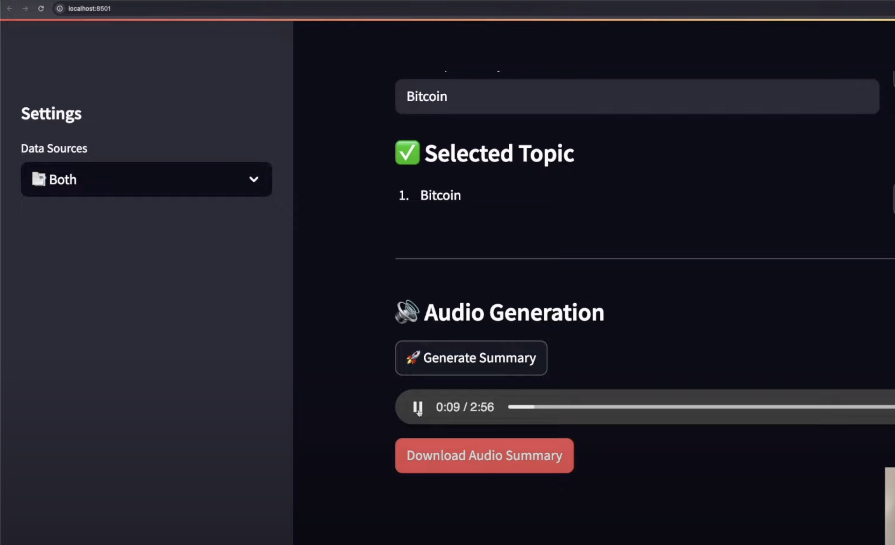

# AI_Journlaist_Chatbot

# 🧠 AI Journalist Chatbot 🎙️

A personalized AI-powered journalist that summarizes the latest **News** and **Reddit** discussions based on your selected topics, and delivers them as **broadcast-style audio**.

---

## ✨ Features

- 📡 Real-time **News** and **Reddit** scraping
- 🧠 Broadcast-style summaries using Claude 3.5
- 🎤 Audio generation with ElevenLabs TTS
- ⚙️ Streamlit frontend with sidebar controls
- 🚀 FastAPI backend with async processing

---

## 📸 Screenshots

### 🔍 1. Streamlit Web UI



### 🔊 3. Audio Output Summary


> 💡 Tip: Use JPG or PNG files, placed in `screenshots/` inside your repo.

---

## 🛠️ Setup Instructions

### 1. Clone the Repository

```bash
git clone https://github.com/Sona30k/AI_Journlaist_Chatbot.git
cd AI_Journlaist_Chatbot
